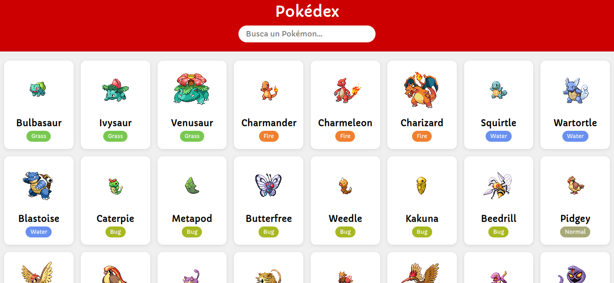
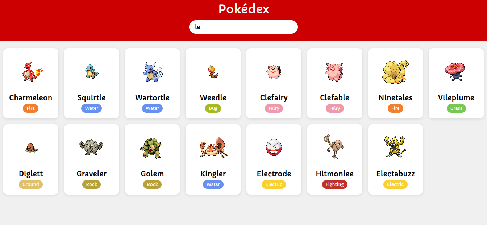

# Pokédex 🔥

Aplicación web que consume la API de Pokémon para mostrar los primeros 151 Pokémon con búsqueda dinámica.

## 🔗 Links

- 🌐 Demo en vivo: [GitHub Pages](https://o0vanfanel0o.github.io/pokedex/)
- 💻 Repositorio: [GitHub](https://github.com/o0VanFanel0o/pokedex)

## 📸 Vista previa

 

## 🛠️ Tecnologías

- HTML5
- CSS3
- JavaScript (fetch, async/await)
- API REST (PokéAPI)

## 🎯 Funcionalidades

- Mostrar 151 Pokémon
- Búsqueda en tiempo real
- Tarjetas dinámicas
- Consumo de API externa

## 👤 Autor

- GitHub: [@o0VanFanel0o](https://github.com/o0VanFanel0o)
